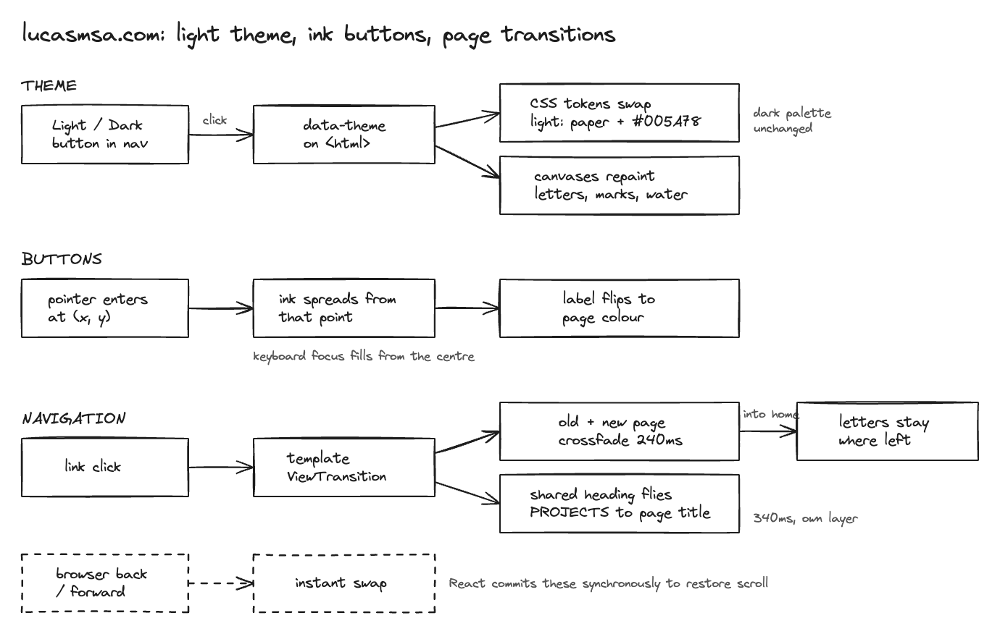

# 6. A paper light theme, ink buttons and page transitions

Date: 2026-09-24

## Status

Accepted. Supersedes the dark-only rule of [ADR-0001](0001-nextjs-dark-three-locales.md).
The dark palette, type and layout of [ADR-0005](0005-condensed-editorial.md) stand.

## Decision

- Two themes. Light is the default for visitors whose system is light, dark for
  those whose system is dark, and a Light/Dark button in the nav overrides it.
  `next-themes` sets `data-theme` on `<html>` and stores the choice in
  `localStorage`.
- Dark is the palette of ADR-0005, unchanged: `#070A0F`, `#E2ECF5`, muted
  `#ADB9C9`, rules `#152030`, accent `#4DE1FF`, and the cyan water.
- Light: paper `#F1EFE9`, ink `#111114`, muted `#4C4B52`, rules `#D9D6CD`, accent
  `#005A78`, the dark theme's cyan deepened until it reads on paper. The water
  under the photo follows the accent, as it does in dark.
- Links are underlined at rest in a faint accent underline, which turns solid and
  thicker on hover. The current page and locale keep the solid underline.
- Buttons (the hero controls and the theme button) are square-cornered and outlined
  in the accent. On hover, ink in the accent spreads from the point where the pointer
  entered, with a displaced wet edge, and the label flips to the page colour.
  Keyboard focus fills from the centre. This is `InkButton` with `useInkFill`; the
  `#ink-edge` SVG filter is rendered once in the site layout.
- The canvas pieces read `--acc-rgb` (pixel marks) and `--water-rgb`,
  `--sea-mid-rgb`, `--sea-deep-rgb`, `--sea-tint-rgb` (the water) through
  `useThemeInk`, and repaint when `data-theme` changes. The physics name already
  paints with the body colour every frame.
- Page changes use View Transitions through Next's `experimental.viewTransition`
  and React's `unstable_ViewTransition`. The Projects and Writing headings on home
  share a name with the title of their own page, so the heading morphs into the
  title. The site `template.tsx` wraps every page in one `ViewTransition`, so each
  link navigation crossfades the old and new page together over 240ms while any
  shared heading flies for 340ms on its own layer. Browser back and forward stay
  instant.
- Coming back to home restores the letters where they were left, rather than
  dropping them in again. A full reload still drops them, per ADR-0002.

## Context

Light palettes were judged as miniatures of the live home page on the real copy,
photo and pixel marks. Paper won on the ground, but ultramarine was rejected on
sight. Forest was chosen next from four accents on paper and built in both themes.
Its green-black dark ground and green water read as murky pond water, and a neutral
dark ground with teal water was tried and set aside too: the original dark site was
preferred over both. With dark back to cyan, the light accent moved to the same hue.
Four deepened cyans were captured on the real light page, and `#005A78` was chosen.

Before this, every clickable was muted text that only changed colour on hover, so
nothing read as a link at rest. Four treatments were rendered (highlighter band,
underline, arrow cues, inverted ink tabs), and underlined links with outlined
buttons were taken. The button fill was chosen from three live demos: a mirrored
inkblot, a single ink drop with a wet edge, and a clean circle. The single ink drop
won.

Contrast against each ground, WCAG AA throughout:

| | Foreground | Muted | Accent |
|---|---|---|---|
| Light | 16.4:1 | 7.5:1 | 6.7:1 |
| Dark | 16.6:1 | 10.0:1 | 12.8:1 |

Rive was considered for the nav logo, per-project glyphs, the gravity control, a
footer signature and page transitions. The site does not use it. For transitions in
particular, Rive draws only inside its own canvas, so it cannot carry a real page
element from one route into the next; it could only play an overlay on top, at the
cost of a WASM runtime on every route and a wait on every navigation. Four View
Transition styles were demoed (heading morph, crossfade, rise, ink reveal) and the
heading morph was chosen.

## Consequences

The logo PNG is white line art, so light mode inverts it with a CSS filter rather
than shipping a second file.

Anything new drawn on a canvas has to read its colours from the `-rgb` tokens
through `useThemeInk`, or it will stay in one theme's colours after a toggle.

`experimental.viewTransition` makes Next serve React's experimental build on every
route. The type package names the component `ViewTransition` while the runtime
exports `unstable_ViewTransition`, bridged in `src/types/react-view-transition.d.ts`.
Both go away once the component is stable and the flag is dropped.

A shared transition name must be unique on the page at the moment of navigation,
so only one heading per section may carry it.

React commits back and forward navigations synchronously so the browser can restore
scroll, which rules out a view transition there. Browsers that animate their own
swipe-back gesture would also stack a second animation on top of it.

A first version morphed the heading while the new page was already fading in. On
the real page the home heading starts far down, so it flew across legible text.
Holding the new page back until the heading lands fixed it. Returning home also
read as a restart, because the name dropped in again on every visit and the
canvases painted a frame late, so the letter poses are now kept in module state
across client navigations and the canvases read theme colours on their first
render. A fade-out-then-in with a gap made the photo, letters and pixel marks
blink, so the fade overlaps, the canvases paint in layout effects before the first
frame, and the decoded photo is reused across visits. The water canvas also carries
its size in the server markup; set only from its effect, it started at zero height
and pushed the page down by 260px as it grew.

The theme button renders hidden until the client has read the theme, because the
server cannot know it. `visibility: hidden` keeps its space, so the nav does not
shift.
